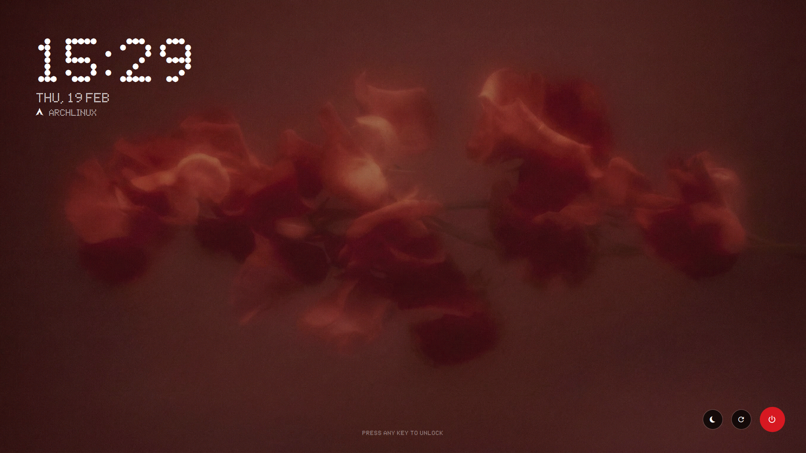
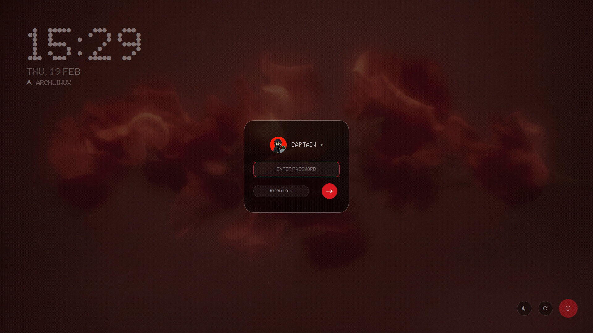

# ✨ Glyph SDDM

A high-end, minimalist SDDM theme inspired by the **Nothing Phone** aesthetic. Featuring authentic dot-matrix typography, intelligent adaptive coloring, and premium "obsidian glass" interactions.

<div align="center">
  
  
</div>

## 🌟 Features

- **True Nothing Typography:** Powered by the `Ndot` font family with an adaptive monospaced grid for a perfectly balanced clock.
- **Adaptive Monochrome:** The clock automatically switches between **Pure Black** and **Pure White** based on your wallpaper's brightness.
- **Obsidian Glass UI:** A sleek, 55% translucent dark card with a precision white border and "Material You" red accents.
- **Cinematic Reveal:** The clock materializes with a smooth, delayed fade-in after the wallpaper is processed.
- **Crimson Minimalism Switchers:** Fully keyboard-navigable user and session lists with a gliding **Nothing Red** dot indicator.
- **Pro Interactions:** Snappy slide-up reveal, tactile "⋯" loading states, and a red-flashing error shake for incorrect PINs.
- **Dynamic Distro Integration:** Automatically detects and displays your OS name and logo (Arch, Nix, Fedora, etc.).

---

## 📦 Prerequisites

Before installing, you **must** install the required Qt5 modules for your distribution to avoid a black screen:

<details>
<summary><b>Arch Linux / CachyOS / Manjaro</b> (Click to expand)</summary>

```bash
sudo pacman -S --needed qt5-graphicaleffects qt5-quickcontrols2 qt5-svg
```
</details>

<details>
<summary><b>Ubuntu / Debian / Mint / Kali</b> (Click to expand)</summary>

```bash
sudo apt update && sudo apt install qml-module-qtgraphicaleffects qml-module-qtquick-controls2 qml-module-qtquick-layouts libqt5svg5
```
</details>

<details>
<summary><b>Fedora / RHEL / CentOS</b> (Click to expand)</summary>

```bash
sudo dnf install qt5-qtgraphicaleffects qt5-qtquickcontrols2 qt5-qtsvg
```
</details>

<details>
<summary><b>openSUSE</b> (Click to expand)</summary>

```bash
sudo zypper install libqt5-qtgraphicaleffects libqt5-qtquickcontrols2 libqt5-qtsvg
```
</details>

---

## 🚀 Installation

### 1. Automatic Script (Recommended)
This script handles file copying and provides configuration instructions:
```bash
git clone https://github.com/xCaptaiN09/glyph-sddm.git
cd glyph-sddm
sudo ./install.sh
```

### 2. NixOS (Declarative)
NixOS users should add the following snippet to their `/etc/nixos/configuration.nix`:

```nix
{ pkgs, ... }: {
  services.displayManager.sddm = {
    enable = true;
    theme = "glyph-sddm";
  };

  environment.systemPackages = [
    (pkgs.stdenv.mkDerivation {
      name = "glyph-sddm";
      src = pkgs.fetchFromGitHub {
        owner = "xCaptaiN09";
        repo = "glyph-sddm";
        rev = "main";
        sha256 = "sha256-0000000000000000000000000000000000000000000="; # Replace with actual hash after first build attempt
      };
      installPhase = ''
        mkdir -p $out/share/sddm/themes/glyph-sddm
        cp -r * $out/share/sddm/themes/glyph-sddm/
      '';
    })
    pkgs.libsForQt5.qtgraphicaleffects
    pkgs.libsForQt5.qtquickcontrols2
    pkgs.libsForQt5.qtsvg
  ];
}
```

After editing, apply the configuration by running:
```bash
sudo nixos-rebuild switch
```

> [!TIP]
> **First-time build:** Nix will likely report a "hash mismatch" error because of the dummy `sha256` value. Simply copy the **actual hash** from the error message, update it in your config, and run the rebuild command again.

### 3. Manual
1. Clone the repository:
   ```bash
   git clone https://github.com/xCaptaiN09/glyph-sddm.git
   ```
2. Copy the folder to SDDM themes directory:
   ```bash
   sudo cp -r glyph-sddm /usr/share/sddm/themes/glyph-sddm
   ```
3. Set the theme in `/etc/sddm.conf`:
   ```ini
   [Theme]
   Current=glyph-sddm
   ```

---

## 🛠 Configuration & Testing

### Preview Without Logging Out
Run this command to preview the theme:
```bash
sddm-greeter --test-mode --theme /usr/share/sddm/themes/glyph-sddm
```

---

## 🎨 Customization

Edit the files inside `/usr/share/sddm/themes/glyph-sddm/assets/images/`:
- **Wallpaper:** Replace `background.jpg` with your own image.
- **Avatar:** Place your profile picture in `avatar.jpg`.

## 🤝 Credits

- **Author:** [xCaptaiN09](https://github.com/xCaptaiN09)
- **Design:** Inspired by Nothing Phone (1) & (2).
- **Font:** Ndot 57 Aligned.

---
*Made with ❤️ for the Linux community.*
