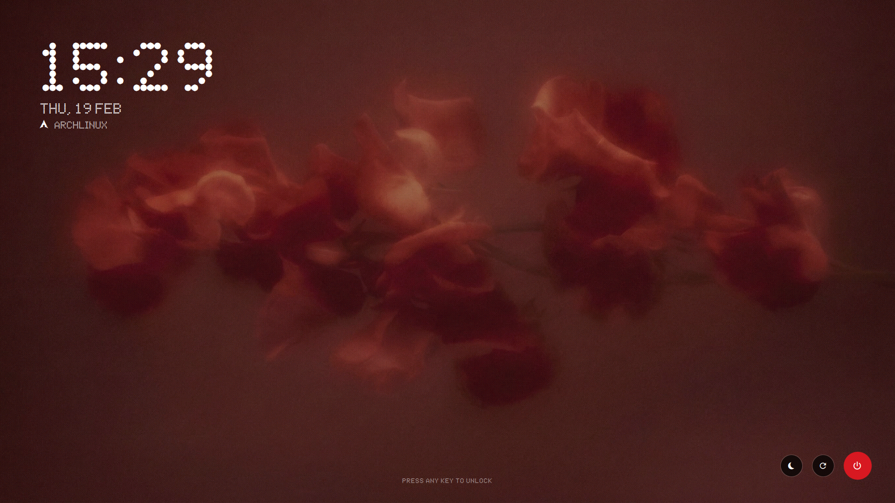
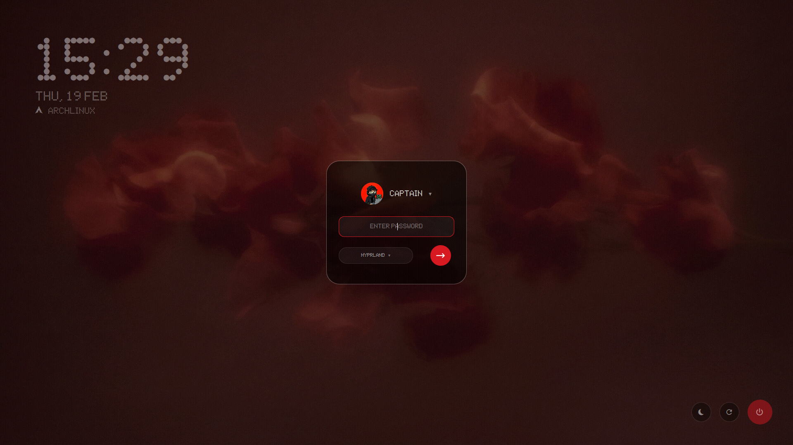
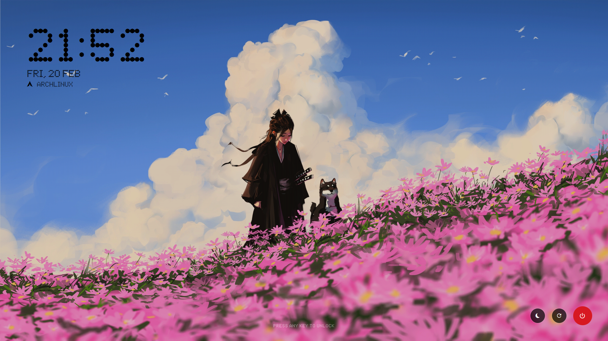
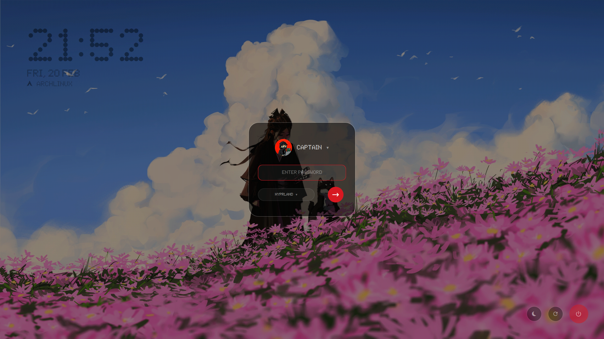
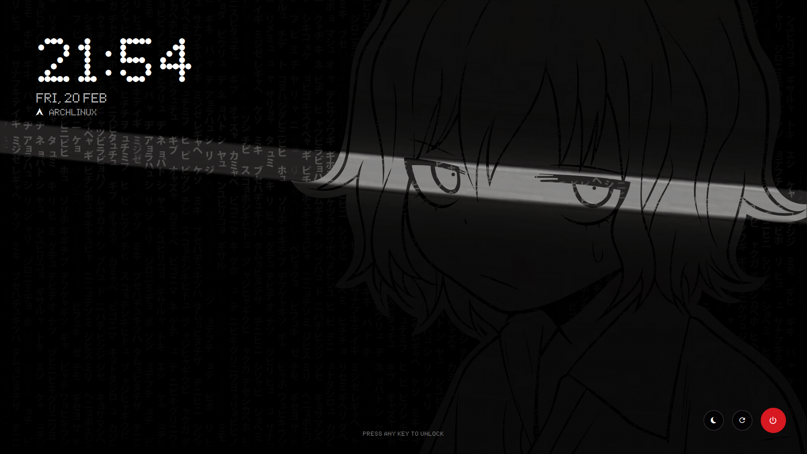
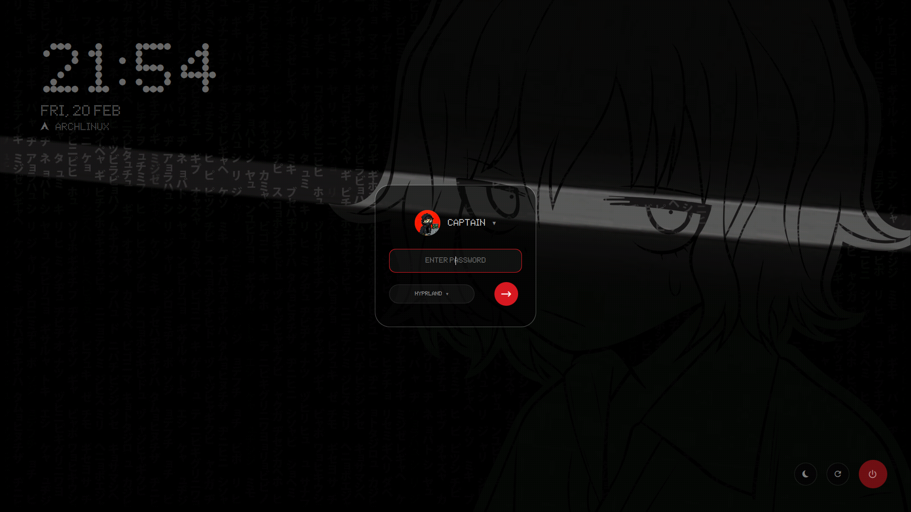
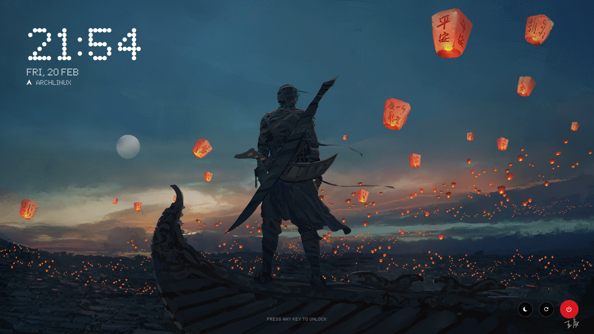
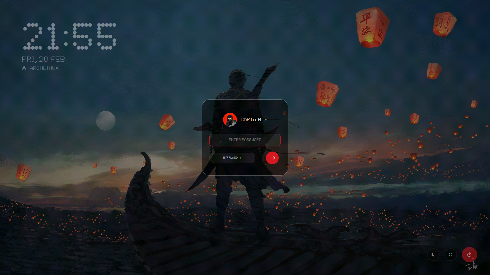
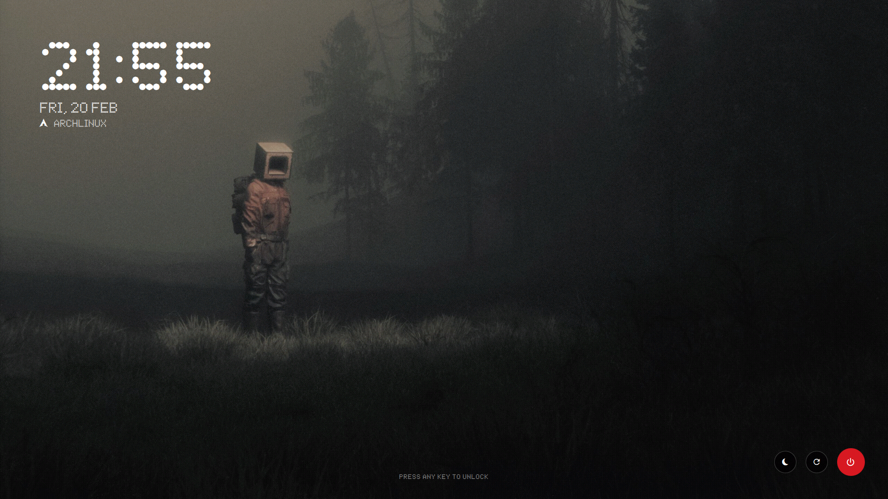
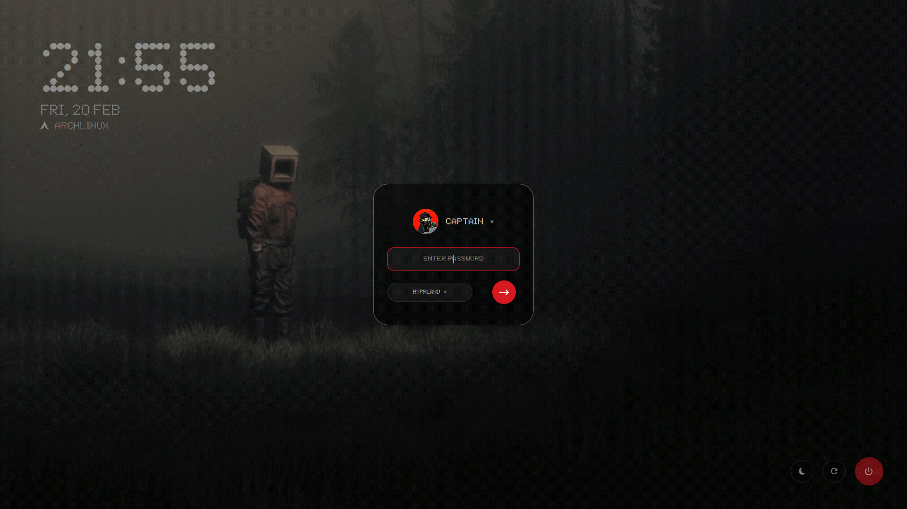

# ✨ Glyph SDDM

A high-end, minimalist SDDM theme inspired by the **Nothing Phone** aesthetic. Featuring authentic dot-matrix typography, intelligent adaptive coloring, and premium "obsidian glass" interactions.

<div align="center">
  
  
</div>

<div align="center">
  
  
  
  
</div>

<div align="center">
  
  
  
  
</div>

## 🌟 Features

- **True Nothing Typography:** Powered by the `Ndot` font family with an adaptive monospaced grid for a perfectly balanced clock.
- **Adaptive Monochrome:** The clock automatically switches between **Pure Black** and **Pure White** based on your wallpaper's brightness.
- **Obsidian Glass UI:** A sleek, 55% translucent dark card with a precision white border and "Material You" red accents.
- **Cinematic Reveal:** The clock materializes with a smooth, delayed fade-in after the wallpaper is processed.
- **Crimson Minimalism Switchers:** Fully keyboard-navigable user and session lists with a gliding **Nothing Red** dot indicator.
- **Pro Interactions:** Snappy slide-up reveal, tactile "⋯" loading states, and a red-flashing error shake for incorrect PINs.
- **Dynamic Distro Integration:** Automatically detects and displays your OS name and logo (Arch, Nix, Fedora, etc.).
- **Universally Compatible:** Works flawlessly on both Qt5 and Qt6 systems without needing separate branches.

---

## 📦 Prerequisites

Glyph SDDM is **Universally Compatible** with both **Qt5** and **Qt6** (including Fedora 40+, Arch Plasma 6, and NixOS). You only need the basic Qt Quick modules:

<details open>
<summary><b>Qt6 (Default / Modern Distros)</b></summary>
Recommended for Fedora 40+, Arch Linux, CachyOS, NixOS.

```bash
# Arch:
sudo pacman -S qt6-declarative qt6-svg qt6-quickcontrols2

# Fedora:
sudo dnf install qt6-qtdeclarative qt6-qtsvg qt6-qtquickcontrols2

# Debian 13/Testing:
sudo apt install libqt6quick6 libqt6qml6 libqt6svg6 libqt6quickcontrols2-6
```
</details>

<details>
<summary><b>Qt5 (Legacy / Stable Distros)</b></summary>
Required for Ubuntu 22.04/24.04, Debian 12, Linux Mint.

```bash
# Ubuntu: sudo apt install qml-module-qtgraphicaleffects qml-module-qtquick-controls2
# Arch: sudo pacman -S qt5-graphicaleffects qt5-quickcontrols2
```
</details>

---

## 🚀 Installation

### 1. Automatic Script (Recommended)
This script handles file copying, backs up your customizations, and provides configuration instructions:
```bash
git clone https://github.com/xCaptaiN09/glyph-sddm.git
cd glyph-sddm
sudo ./install.sh
```

### 2. Arch Linux (AUR)
Glyph SDDM is available on the AUR as `glyph-sddm-git`. You can install it using your favorite AUR helper:
```bash
yay -S glyph-sddm-git
```

### 3. NixOS (Declarative)
Add the following to your `configuration.nix`.

> **Note for Qt6:** If you are on modern NixOS, you **must** use `pkgs.kdePackages.sddm` to ensure the Qt6 platform plugins load correctly. Without this, your mouse cursor may not appear.

```nix
{ pkgs, ... }: {
  services.displayManager.sddm = {
    enable = true;
    theme = "glyph";
    # Crucial for Qt6: Use the KDE/Qt6 build of SDDM to fix missing cursors and module errors
    package = pkgs.kdePackages.sddm; 
    
    # Fix for NixOS explicitly requiring a cursor theme
    settings = {
      Theme = {
        CursorTheme = "breeze_cursors"; # Change this if you use a different cursor theme (e.g., Adwaita)
      };
    };
  };

  environment.systemPackages = [
    (pkgs.stdenv.mkDerivation {
      name = "glyph-sddm";
      src = pkgs.fetchFromGitHub {
        owner = "xCaptaiN09";
        repo = "glyph-sddm";
        rev = "main";
        hash = pkgs.lib.fakeHash;
      };
      installPhase = "
        mkdir -p $out/share/sddm/themes/glyph
        cp -r * $out/share/sddm/themes/glyph/
      ";
    })
    # Correct Qt6 dependencies for NixOS
    pkgs.kdePackages.qtdeclarative
    pkgs.kdePackages.qtsvg
    pkgs.kdePackages.qt5compat # Included for wider QML component compatibility
  ];
}
```

### 4. Manual
1. Clone the repository:
   ```bash
   git clone https://github.com/xCaptaiN09/glyph-sddm.git
   ```
2. Copy the folder to SDDM themes directory:
   ```bash
   sudo cp -r glyph-sddm /usr/share/sddm/themes/glyph
   ```
3. Set the theme in `/etc/sddm.conf`:
   ```ini
   [Theme]
   Current=glyph
   ```

---

## 🛠 Configuration & Testing

### Preview Without Logging Out
Run this command to preview the theme:
```bash
# For Qt6 (Modern):
sddm-greeter-qt6 --test-mode --theme /usr/share/sddm/themes/glyph

# For Qt5 (Legacy):
sddm-greeter --test-mode --theme /usr/share/sddm/themes/glyph
```

### Customization
Edit `theme.conf` or replace assets in `assets/images/`:
- **Wallpaper:** Replace `assets/images/background.jpg`.
- **Avatar:** Replace `assets/images/avatar.jpg`.
- **Clock Format:** Set `use24HourClock=true` in `theme.conf` to switch to a 24-hour clock, or `use24HourClock=false` for 12-hour.

## 🤝 Credits

- **Author:** [xCaptaiN09](https://github.com/xCaptaiN09)
- **Design:** Inspired by Nothing Phone (1) & (2).
- **Fonts:** Ndot 57 Aligned & Symbols Nerd Font (included).

---
*Made with ❤️ for the Linux community.*
```
